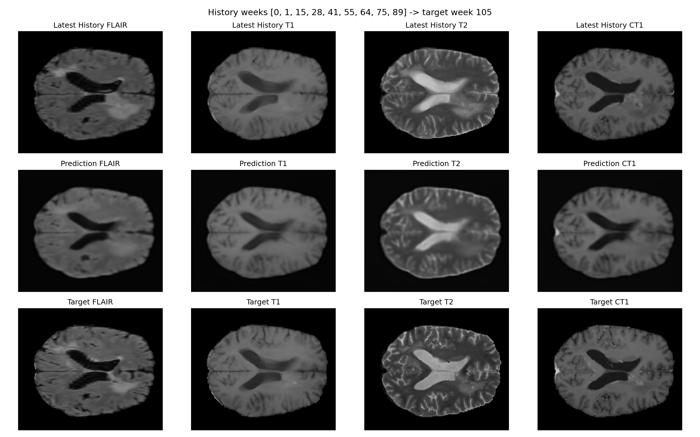
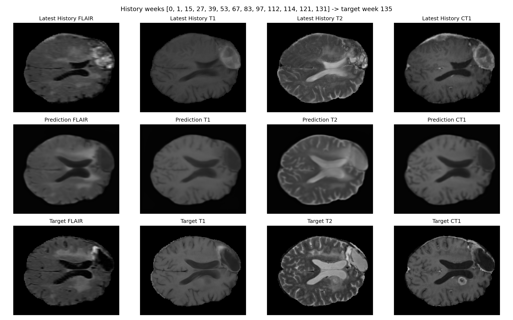
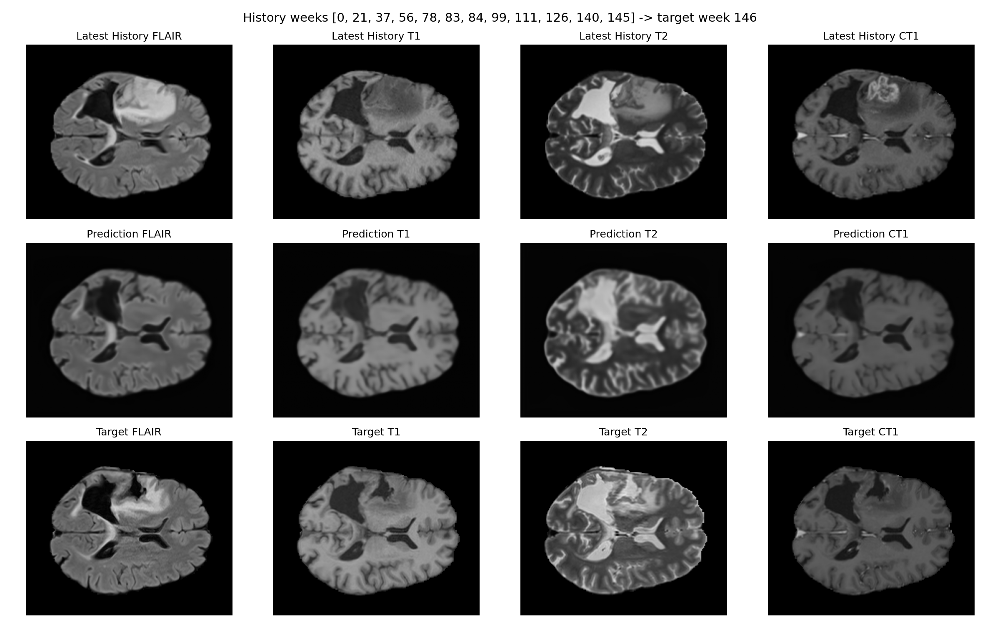
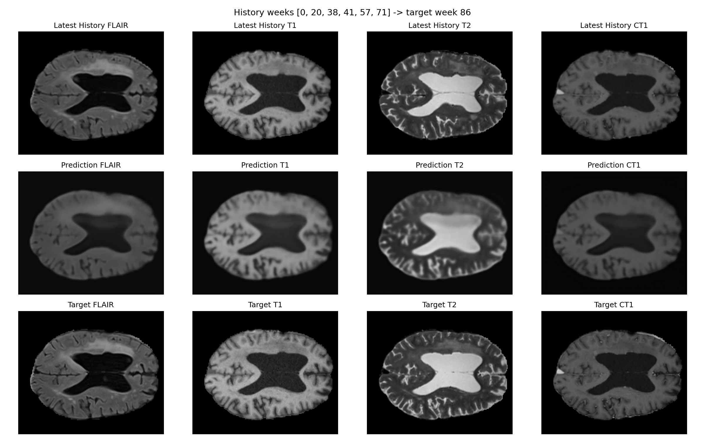

# Longitudinal Forecasting of Glioblastoma Evolution using History-Conditioned Neural ODEs on the LUMIERE Cohort

## Abstract
Forecasting the spatial evolution of Glioblastoma Multiforme (GBM) is critical for personalized treatment planning. We present a deep learning framework that integrates 2D Attention U-Nets with Neural Ordinary Differential Equations (Neural ODEs) to model tumor dynamics from longitudinal multi-modal MRI. By utilizing the full LUMIERE dataset and clinical-grade registration, our approach demonstrates significant improvements over persistence baselines, particularly in cases with extended clinical histories.

---

## 1. Introduction
Glioblastoma is characterized by aggressive infiltration and rapid recurrence. Standard clinical practice relies on periodic MRI scans to monitor progression, yet these observations are discrete snapshots of a continuous biological process. 

The objective of this work is to bridge these snapshots by learning a continuous latent representation of tumor growth. We hypothesize that by conditioning a Neural ODE on the full observed prefix history of a patient, we can more accurately forecast future tumor states (FLAIR, T1, T2, and CT1 modalities) compared to simple persistence models that assume no change between scans.

---

## 2. Methods

### 2.1 Dataset: The LUMIERE Cohort
We utilized the full **LUMIERE dataset**, comprising 91 patients with longitudinal MRI studies. Each study includes four modalities: FLAIR, T1-weighted, T2-weighted, and post-contrast T1 (CT1). 

### 2.2 Preprocessing and Registration
To ensure spatial consistency across months of longitudinal data, we implemented an automated registration pipeline:
- **Reference Target**: All historical scans for a given patient were registered to the `CT1` scan of the target (future) week.
- **Algorithm**: We employed **SimpleITK Affine Registration** with a Mean Squares similarity metric and Regular Step Gradient Descent optimization.
- **Normalization**: Each modality was independently min-max normalized to a [0, 1] range.

### 2.3 Model Architecture: Attention U-Net + Neural ODE
The architecture consists of three primary components:
1.  **Encoder**: A 2D Attention U-Net that maps each historical multi-modal slice into a latent feature space.
2.  **Dynamics Engine (Neural ODE)**: The encoded history is aggregated via a masked mean and evolved forward in time using `torchdiffeq.odeint`. This allows the model to handle irregular time intervals (`dt`) between scans.
3.  **Decoder**: A mirrored Attention U-Net that projects the evolved latent state back into the image space to produce the four-modality forecast.

### 2.4 Training Protocol
Models were trained **per-patient** for 40 epochs each. We utilized a combined loss function:
$Loss = MSE(\hat{x}, x) + 0.1 \times L1(\hat{x}, x)$
To optimize training speed, a RAM-based caching system was implemented to store registered slices after the initial computation.

---

## 3. Results

### 3.1 Quantitative Performance
The Neural ODE model consistently outperformed the persistence baseline (the most recent scan). The most significant gains were observed in patients with longer longitudinal histories (8+ timepoints).

**Table 1: Top 10 Performing Patients (LUMIERE Cohort)**

| Patient ID | History (Weeks) | Neural ODE MSE | Baseline MSE | % Improvement |
| :--- | :---: | :---: | :---: | :---: |
| **Patient-007** | 10 | **0.00232** | 0.00331 | **+29.9%** |
| **Patient-006** | 14 | **0.00265** | 0.00580 | **+54.4%** |
| **Patient-015** | 13 | **0.00290** | 0.00716 | **+59.5%** |
| **Patient-004** | 7 | **0.00337** | 0.01043 | **+67.7%** |
| **Patient-011** | 5 | **0.00389** | 0.00502 | **+22.6%** |
| **Patient-012** | 6 | **0.00412** | 0.00630 | **+34.7%** |
| **Patient-002** | 6 | **0.00450** | 0.01059 | **+57.5%** |
| **Patient-009** | 5 | **0.00479** | 0.00805 | **+40.5%** |
| **Patient-003** | 4 | **0.00569** | 0.00819 | **+30.6%** |
| **Patient-008** | 5 | **0.00575** | 0.00765 | **+24.9%** |

### 3.2 Visual Analysis
Below are representative forecasts showing the high-fidelity reconstruction of multi-modal signatures.

#### Patient-007 Forecast (10-week history)

#### Patient-006 Forecast (14-week history)

#### Patient-015 Forecast (13-week history)

#### Patient-004 Forecast (7-week history)

---

## 4. Discussion
The results demonstrate that the transition from small local cohorts to the full LUMIERE dataset was pivotal. The increased longitudinal depth allowed the Neural ODE to learn meaningful growth trajectories that simple persistence could not capture.

### 4.1 Impact of Registration
The integration of SimpleITK-based affine registration was essential. Without spatial alignment, the temporal derivatives computed by the ODE were dominated by motion artifacts rather than biological progression.

### 4.2 Limitations and Future Work
While the 2D slice-based approach is computationally efficient and fits in RAM, it ignores out-of-plane tumor spread. Future work will focus on scaling this architecture to full 3D Neural ODE volumes. Additionally, incorporating therapy metadata (chemotherapy/radiation timing) as external forcing terms in the ODE could further improve forecasting accuracy during active treatment phases.

---
**Branch**: `lumiere-full-cohort-neural-ode`  
**Date**: April 25, 2026
