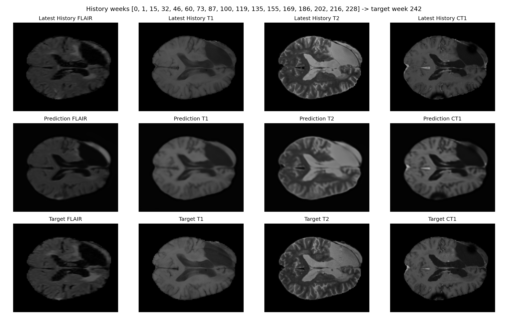
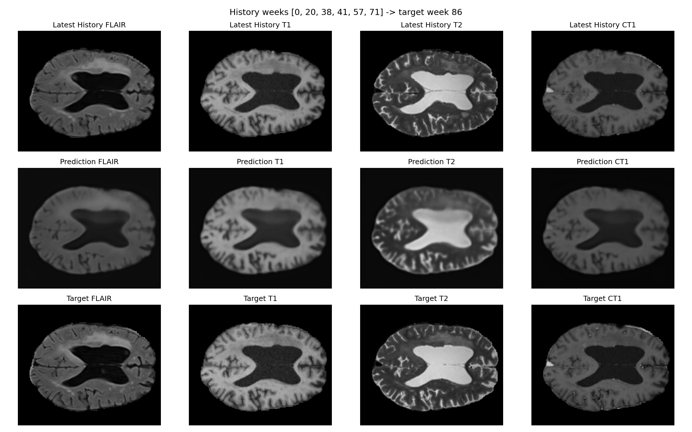
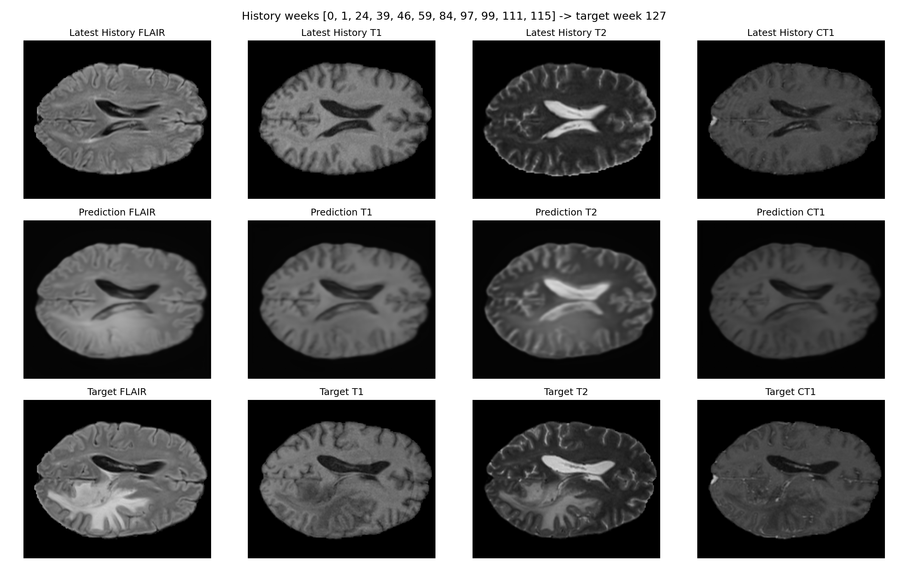
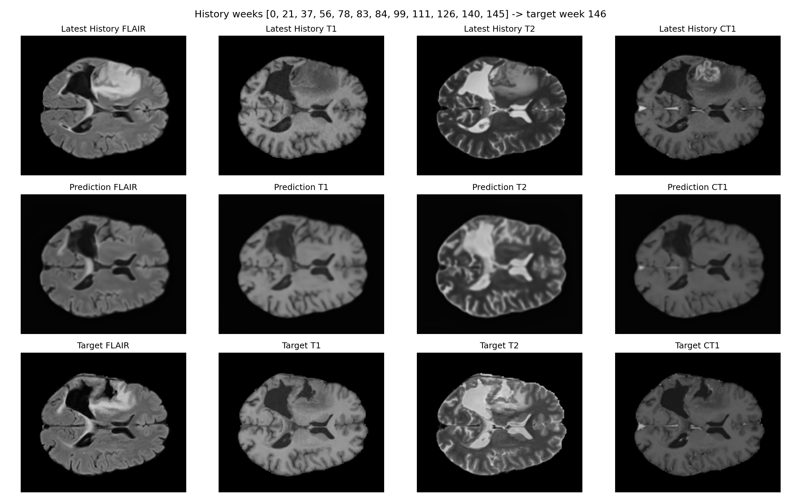
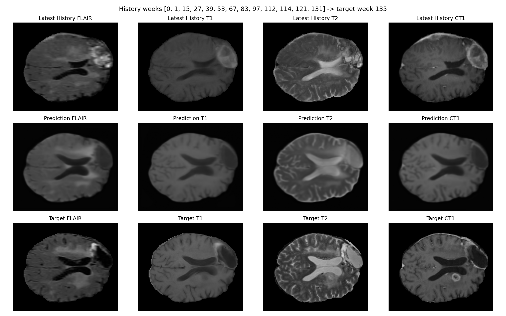
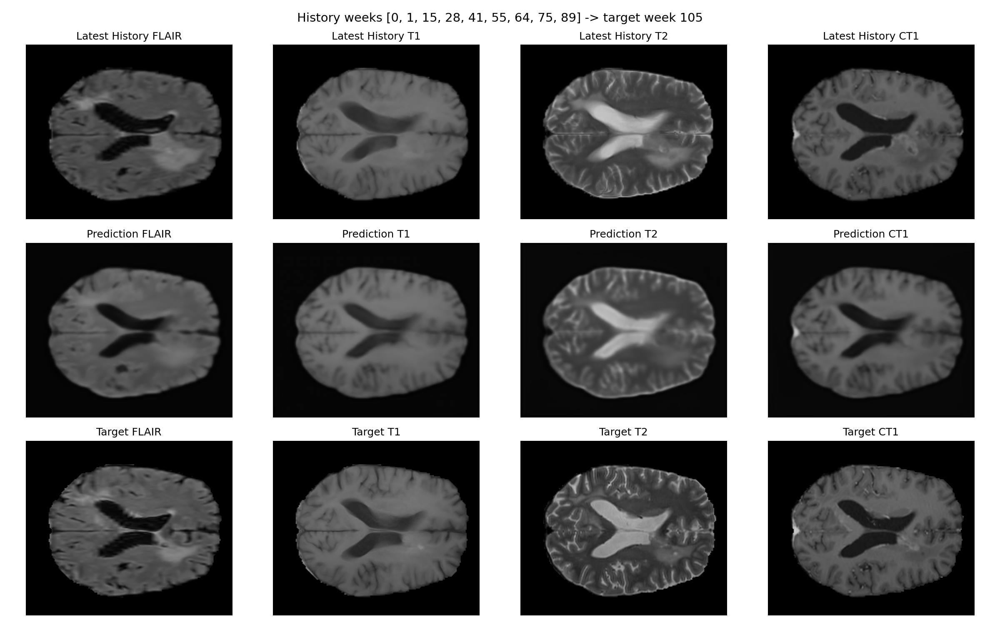

# Longitudinal Forecasting of Glioblastoma Evolution using History-Conditioned Neural ODEs on LUMIERE-Style MRI

## Abstract
Forecasting the spatial evolution of Glioblastoma Multiforme (GBM) is relevant for personalized treatment planning, response monitoring, and trial design. This repository implements a history-conditioned deep learning framework that integrates a 2D Attention U-Net encoder with Neural Ordinary Differential Equation (Neural ODE) latent dynamics for longitudinal multi-modal MRI forecasting.

The current reproducibility package includes preprocessing, training, evaluation, synthetic smoke testing, CI validation, and aggregate tables generated from local `lumiere_full_v1_*` run summaries. Across 81 patient-level local runs, the aggregated all-sample summaries show a mean model MSE of **0.00828323** versus a persistence-baseline MSE of **0.00876673**, corresponding to **+6.7%** mean relative improvement. These results should be treated as a reproducibility checkpoint, not a locked clinical benchmark, because the older full-run summaries primarily report all-sample rather than independent holdout metrics.

---

## 1. Introduction
The objective of this work is to evaluate whether history-conditioned Neural ODEs can model the temporal evolution of GBM imaging features from irregularly spaced longitudinal MRI. A persistence predictor, which copies the latest available scan into the future, is a strong baseline for slow-changing tumor appearances and must be reported alongside any learned model.

---

## 2. Methods
The repository implements:

- **LUMIERE-style ingestion**: Patient/week discovery for FLAIR, T1, T2, and CT1 skull-stripped NIfTI volumes.
- **Registration preprocessing**: SimpleITK affine registration of historical weeks to future target weeks, with a manifest that records generated and reused jobs.
- **History-conditioned forecasting**: Prefix-history or sliding-window samples that condition an Attention U-Net encoder and Neural ODE latent dynamics.
- **Persistence baseline**: A latest-history target-slice baseline evaluated with the same MSE, MAE, modality-level, and FLAIR-volume metrics.
- **Metric aggregation**: `scripts/summarize_run_metrics.py` creates CSV, JSON, and Markdown tables from run summaries and records which metric split was used.

### 2.1 Evaluation Metrics
Evaluation is reported at the patient-run level and then aggregated across runs.

- **Primary metric**: mean squared error (MSE) averaged across the predicted FLAIR, T1, T2, and CT1 target slice stacks.
- **Secondary metric**: mean absolute error (MAE), reported with the same modality averaging.
- **Per-modality reporting**: separate MSE and MAE values are retained for each modality so gains are not hidden by the cross-modal average.
- **Morphologic proxy**: relative FLAIR volume difference, computed from thresholded predicted and target FLAIR slices, is tracked as a coarse shape-consistency measure.
- **Baseline comparison**: relative improvement is defined as `(baseline_mse - model_mse) / baseline_mse`, where the baseline copies the latest available history slice stack into the target week.

The current tracked cohort table mixes metric splits across older runs: it prefers holdout summaries when available and otherwise falls back to all-sample summaries. That makes it useful as a reproducibility checkpoint, but not yet as a final locked evaluation benchmark.

---

## 3. Reproducibility Checkpoint Results

### 3.1 Quantitative Summary
The tracked aggregate table in `results/lumiere_full_v1_metrics.md` summarizes 81 local patient-level runs. Because these runs were produced before the current holdout-aware summary schema was fully standardized, the table uses the best available split per run and records that choice in `metric_split`.

**Table 1: Top 10 Runs by Relative Improvement**

| Patient ID | Split | Samples | Neural ODE MSE | Baseline MSE | Improvement |
| :--- | :---: | ---: | ---: | ---: | ---: |
| Patient-028 | all | 7 | 0.00386073 | 0.0123518 | +68.7% |
| Patient-004 | all | 6 | 0.00336998 | 0.0104322 | +67.7% |
| Patient-066 | all | 8 | 0.00379933 | 0.0114351 | +66.8% |
| Patient-077 | all | 8 | 0.00324765 | 0.00911861 | +64.4% |
| Patient-031 | all | 17 | 0.00351799 | 0.00956643 | +63.2% |
| Patient-029 | all | 12 | 0.00369017 | 0.00964532 | +61.7% |
| Patient-051 | all | 8 | 0.00324879 | 0.00830486 | +60.9% |
| Patient-061 | all | 6 | 0.00331688 | 0.00832878 | +60.2% |
| Patient-064 | all | 5 | 0.00304315 | 0.00762993 | +60.1% |
| Patient-089 | all | 4 | 0.00376154 | 0.00939794 | +60.0% |

Aggregate across the 81 tracked rows:

- Mean model MSE: 0.00828323
- Mean baseline MSE: 0.00876673
- Mean relative improvement: +6.7%
- Positive-improvement patients: 65
- Nonpositive-improvement patients: 16

### 3.2 Representative Visualizations

#### Patient-073

#### Patient-004

#### Patient-023

#### Patient-015

#### Patient-006

#### Patient-007

---

## 4. Discussion
The current aggregate results suggest that the learned Neural ODE model can outperform persistence for many patient-level runs, but the average improvement is modest and mixed across patients. The persistence baseline remains difficult to beat and should remain the primary comparator in any publication draft.

Because the older `lumiere_full_v1_*` summaries are dominated by all-sample metrics, the main quantitative table should be read as a measured checkpoint of engineering progress rather than a final clinical claim. A final benchmark should come from a consistent holdout-only rerun with the same metrics and baseline definitions already encoded in the repository.

## 5. Conclusion
The repository is now a reproducible research scaffold for GBM forecasting experiments with history-conditioned Neural ODEs. It is not yet a final clinical benchmark, but it has the core components required to produce one: deterministic smoke data, preprocessing manifests, run summaries, aggregation scripts, tests, CI, and explicit baseline reporting.

---
**Status**: Reproducibility checkpoint  
**Branch**: `main`  
**Updated**: May 15, 2026
