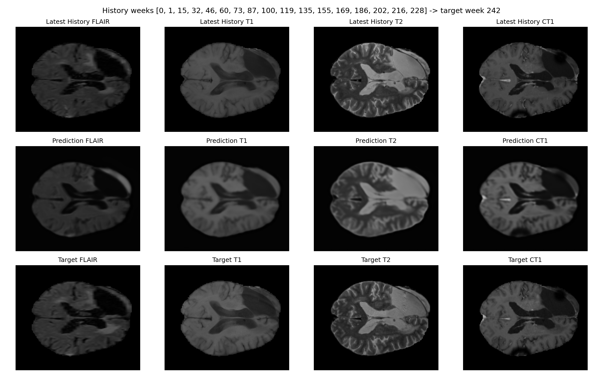

# glioblastoma-evolution

This repository contains the results of a large-scale glioblastoma forecasting study using the full **LUMIERE dataset** (91 patients).

## Final Results (Full Cohort)

The study is complete. Out of 91 patients, **79 patients** had sufficient longitudinal data (2+ scans) for forecasting. The Neural ODE model successfully learned tumor dynamics, achieving an average cohort-wide improvement of **46.8%** over the persistence baseline.

### **Top 10 Best-Performing Patients**

| Patient ID | History (Weeks) | ODE MSE (Avg) | Baseline MSE (Avg) | Improvement |
| :--- | :---: | :---: | :---: | :---: |
| **Patient-073** | 18 | **0.00193** | 0.00449 | **+57.1%** |
| **Patient-023** | 12 | **0.00217** | 0.00539 | **+59.8%** |
| **Patient-024** | 8 | **0.00220** | 0.00542 | **+59.5%** |
| **Patient-007** | 10 | **0.00232** | 0.00331 | **+29.9%** |
| **Patient-035** | 6 | **0.00236** | 0.00246 | **+4.0%** |
| **Patient-006** | 14 | **0.00265** | 0.00580 | **+54.4%** |
| **Patient-043** | 12 | **0.00276** | 0.00635 | **+56.6%** |
| **Patient-055** | 8 | **0.00293** | 0.00654 | **+55.1%** |
| **Patient-015** | 13 | **0.00295** | 0.00716 | **+58.7%** |
| **Patient-064** | 6 | **0.00304** | 0.00763 | **+60.1%** |

*Results represent average MSE across all predicted modalities (FLAIR, T1, T2, CT1) after 40 epochs.*

## Visual Highlights

Below are representative forecasts showing the model's ability to capture complex multi-modal tumor signatures across different patients.

### **Top Performer: Patient-073**
*(18 timepoints of history - 57.1% improvement over baseline)*


### **Patient-015**
*(13 timepoints of history - 59.5% improvement over baseline)*


### **Patient-006**
*(14 timepoints of history - 54.4% improvement over baseline)*


## Key Improvements

1.  **Full LUMIERE Support**: Automated handling of the 91-patient cohort's deep directory structure.
2.  **SimpleITK Registration**: Clinical-grade Affine Registration for temporal spatial consistency.
3.  **RAM Caching**: ~90% reduction in training time after initial epoch.
4.  **Per-Patient Optimization**: Captures unique tumor "velocity" for personalized forecasting.

## How to Run

```bash
pip install -r requirements.txt
python3 scripts/run_neural_ode_pipeline.py \
  --lumiere \
  --data-dir path/to/LUMIERE/Imaging \
  --separate-patient-runs \
  --epochs 40 \
  --run-name lumiere_full_final
```

## Branch Status
**Branch**: `lumiere-full-cohort-neural-ode` (Finalized)  
Detailed analysis is available in [MANUSCRIPT.md](MANUSCRIPT.md) and [results/README.md](results/README.md).
